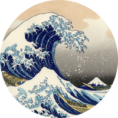

Underwave: Background Image-Loading Library
============================================

[](https://travis-ci.com/Aallam/Underwave)

**Underwave** is a simple library to asynchronously download and load images to views, with memory 
and disk caching, resource pooling, and request cancellation support.

**Underwave** can be used to load images to simple views or lists of views with efficiency.

<p align="center">
  
</p>

Quick Start
-----------
**Underwave** API is simple and straightforward:

### Simple
Use `load` function to load an image to an [ImageView][1], :
````kotlin
Underwave.with(context).load("https://www.example.com/image.jpg", imageView)
````
````kotlin
imageView.load("https://www.example.com/image.jpg")
````

### Scoped
Use `insert` function to take advantage of a custom coroutine scope (UI scope for example):
````kotlin
uiScope.launch {
    Underwave.with(context).insert("https://www.example.com/image.jpg", imageView)
}
````
````kotlin
uiScope.launch {
    imageView.insert("https://www.example.com/image.jpg")
}
````

### Cancellation
Call `cancel()` on `Request` object to cancel the loading operation:
````kotlin
val request = Underwave.with(context).load("https://www.example.com/image.jpg", imageView)
//...
request.cancel()
````
````kotlin
val request = imageView.insert("https://www.example.com/image.jpg")
//...
request.cancel()
````
Requirements
------------
* Min SDK 21
* Compile SDK: 29+
* AndroidX
* Java 8+

R8 / Proguard
-------------
If you use Proguard, you may need to add rules for [coroutines][2].

License
-------

Underwave is distributed under the terms of the Apache License (Version 2.0). 
See [LICENSE](LICENSE) for details.

[1]: https://developer.android.com/reference/android/widget/ImageView
[2]: https://github.com/Kotlin/kotlinx.coroutines/blob/master/kotlinx-coroutines-core/jvm/resources/META-INF/proguard/coroutines.pro
